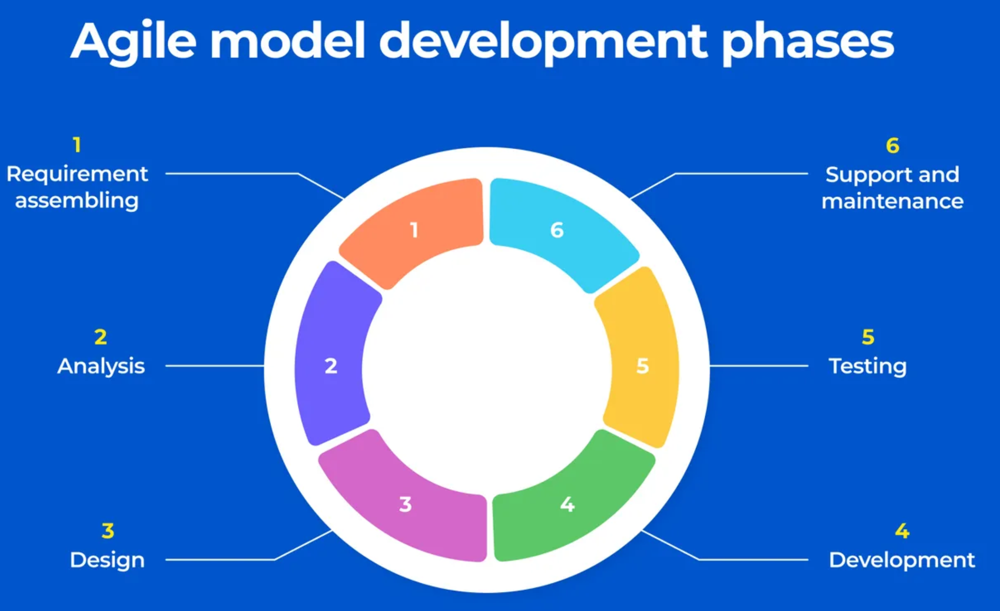

```{r setup, include=FALSE}
knitr::opts_chunk$set(echo = TRUE)
```

This tutorial aims to give a basic overview of the most useful R programming practices. The first part focuses on syntax, function documentation and package development. The second part introduces common principles of unit testing and their application to R software development. 

# Syntax

Although not mandatory, using a consistent syntax structure will improve the software development process and readability, as well as make it easier to make changes to your code in the future.

## Spacing and indents

Spacing should be used before and after infix operators (e.g. `=`, `+`, `-`, `<-`) and after commas.

The indentation of two spaces should be used for breaking a long function into multiple lines. The indented line should finish at the same level as where it started. R Studio IDE has a built-in option to show indent guide lines - this can be done in `Tools/Global Options/Code/Display/Indentation Guides/Rainbow lines`.

Line length should be at max 80 characters per line. This would not only improve readability on smaller screen sizes but also help determine whether the code can be split into a distinct function. R Studio IDE has a built-in option to show the 80 characters limit - this can be done in `Tools/Global Options/Code/Display/Show margin column 80`.

```{r Line spacing and indent, eval = FALSE}
# Good spacing and indentation

add_100 <- 
  function(x) {
    x <- 100 + x
    if (x > 100) {
      print("X is higher than 100")
    } else {
      print("X is not higher than 100")
    }
    
    return(x)
  }
```

Comments should start with a `#` followed by a single space. They should explain *why* the code is written and not *what* (the code should be self-explanatory for understanding what is going on). Although using comments for breaking up a script into multiple chunks is a fairly common practice, it is generally easier to split your code into multiple scripts, making it more organised and easier to read.

## Assignment

The assignment operator used should be `<-` while `=` can be used for arguments.

## Function calls

Curly brackets should be used for `if-else` statements. The first curly bracket must start on the `if` starting line, while the second one can be either on a new line (for `if` statements only) or on the next step of the statement (for `if-else` statements).

```{r}
# Good use of curly brackets

vec <- c(1, 2, 3, 4, 5)

for (x in seq_along(vec)){
  
  if (x > 3) {
    x <- x + 1
    
  } else if (x == 3) {
    x <- x - 1
    
  } else if (x == 5) {
    x <- x + 10
  }
}
```


Function calls should have a double colon (`::`) for exported function calls and a triple colon (`:::` or `:::.` for hidden objects) for internal package functions. This will ensure that there is no confusion on which package the function comes from in case of function name overlap and it will also help with using containerisation (e.g. Docker) within the project.

```{r Line length, eval = FALSE}
# Good syntax

add_100 <- 
  function(x) {
    x <- 100 + x
    if (x > 100) {
      print("X is higher than 100")
    } else {
      print("X is not higher than 100")
    }
    
    return(x)
  }

########################################################################## Bad syntax

foo<-function(x){x<-100+x;if(x>100){print("X is higher than 100")}else{print("X is not higher than 100")}}
```

Several R packages have specific functions that can help with improving the code syntax:

-   [lintr::lint()](https://cran.r-project.org/web/packages/lintr/index.html) helps with maintaining a consistent coding style and fix syntax errors thus improving code readability and structure; gives the user the option to manually edit change after change
-   [formatR::tidy_source()](https://cran.r-project.org/web/packages/formatR/index.html) ensures the code is more human-readable and tidy; performs the changes automatically

\newpage

# Naming objects

Multiple case styles are used in programming and software development as such:

-   `camelCase`
-   `snake_case`
-   `PascalCase`
-   `Kebab-case`

The general advice is that `snake_case` is the preferred case style in R since it follows the `tidyverse` model. Another reason is that some database systems have issues with uppercase letters in their names. Dots (i.e. periods) should not be used in object names since it's generally not accepted in other programming languages and may also confuse the user while dealing with S3 objects and classes.

Everything in R is an object. **Object** names should be **nouns** and use lowercase letters and numbers divided by underscores. A good practice is to include the data type/structure at the end of the object.

```{r Object names}
# Good object names

data_tumour_char <- "AABBC"
blood_days_vec <- c(5, 10, 20, 30, 100)
lab_data_df <- 
  data.frame(
    days = c(1, 2, 10, 100),
    patient = c("A", "B", "C", "D")
  )

# Bad object names

aa <- 125
ThisIsMyObject <- "abc"
obj.analysis <- FALSE
```

If a code chunk is likely to be reused over and over again, it is a good idea to comprise it into a function. By definition, a function is a set of statements that can perform a certain task. **Function** names should be **verbs** and use lowercase letters or numbers divided by underscores - and most importantly be meaningful.

```{r Function names}
# Good function names 

add_100 <- function(x) {
  x <- x + 100
  return(x)
}

# Bad function names

x <- function(x) {
   x <- 10 + x 
  return(x)
}

F_100 <- function(x) {
   x <- 10 + x 
  return(x)
}
```

Scripts are used for either storing chunks of code or for the organisation of R packages. A self-explanatory script name will help in grouping functions by their use case. Numbers can be used in the names so that scripts can follow a particular order.

```{r, Script names, eval = FALSE}
# Good script names 

0-utility-functions.R
1-data-preparation.R
2-data-analysis.R

# Bad script names 

my_analysis.R
run_script.R
001.R
```

\newpage

# Documenting functions

A good function starts with a conventional name and proper documentation which is especially important in long or complex functions. Not all functions have to be fully documented, nevertheless having a clear explanation of the purpose, arguments and expected output will help in the software development process. [roxygen2](https://cran.r-project.org/web/packages/roxygen2/index.html) framework provides a useful skeleton. `Ctrl` + `Alt` + `Shift` + `R` can automatically insert an roxygen2 skeleton as below:

```{r Function documentation}
#' Thus function adds two numbers together and then extracts the mean
#'
#' @param x Numeric. 
#' @param y Numeric. 
#' @return Numeric. The sum of x and y.

add_two <- 
  function(x, y) {
    sum <- x + y
    
    return(sum)
  }
```

It is a good idea to include the data type of your parameter argument. If creating a function within a package the `@export` option can control whether the function will be available or not to the user. After adding the function documentation the `devtools::document()` can auto-generate the `roxygen2` skeleton translated in the terms of the R package manual.

\newpage

# Package development

The common purpose of R packages is to bring together a collection of functions that can be reused for different input parameters. Readily available R packages (e.g. from CRAN, Bioconductor, GitHub) perform most of the general tasks, however for performing specific requirements, an R package can be created from the start using the `devtools` framework.

A simple R package structure is comprised of the next directories:

-   **`R`**: this is the directory for all R scripts including functions 
-   **`inst`**: storing R markdown or example data
-   **`man`**: instructions on how to use the functions, very useful while compiling vignettes
-   **`test`**: unit testing
-   **`LICENSE.md`**: any applicable software licenses or restrictions
-   **`pkg_project.Rproj`**

```{r, eval = FALSE}
# Create an R package

devtools::create("example_pkg")

# In the R directory, create a script and write your function

#' Thus function adds two numbers together
#'
#' @param x Numeric. 
#' @param y Numeric. 
#' @return Numeric. The sum of x and y.
#' @export 

add_two <- 
  function(x, y) {
    eg_sum <- x + y
    
    return(eg_sum)
  }

# Document your function

devtools::document()

# Run unit tests 

devtools::test()

# Load all your functions 

devtools::load_all()
```

\newpage

# Unit testing

## SDLC

[](https://www.cleveroad.com/blog/agile-sdlc/)

There are multiple types of testing in the software development life cycle (SDLC):

-   **UI testing**: tests that all software features function as desired
-   **Acceptance testing**: tests that the software fulfils its (business) requirements
-   **Integration testing**: ensures that multiple components work together as expected
-   **Unit testing**: tests the correct behaviour of individual parts of the code (i.e. units) thus ensuring QC

## Why use unit tests?

Unit tests can be performed:

-   **Manually**: common but inadequate practice since it requires time and doesn't ensure that future changes work as expected
-   **Automatically**: best practice ensuring code quality and future-proofing design
-   **Test-Driven Development (TDD)**: write the test before the code, then write the code for the unit test to pass. This can be generalised and applied to test for different programming paradigms, adopting strategies for writing tests etc. 

Manual unit tests are mostly done involuntarily (i.e. checking that the code does its job). Nevertheless, when new functionality is added it may not perform in the same way (e.g. adding a new function argument may affect another variable that was linked to). An extensive amount of time will be spent on tracking the issue and fixing the bug - instead, this time can be spent on creating a test that ensures the function works as expected.

## Unit testing principles

There are multiple concepts to keep in mind while writing unit tests:

-   **Purpose**: ensure that the code not only runs but also does its purpose
-   **Naming tests**: each test should have a relevant name and report clearly where the error has occurred
-   **Coverage**: complex code, as well as simple functions should be tested properly. A single test should check a single case of action. Breaking down a large test into multiple smaller ones is good practice
-   **Linear order**: tests should have the same order in the pipeline as the functions
-   **Running time**: tests should take a few minutes to run, this can help future automation. [Mocks]{style="color: red;"} and [stubs]{style="color: red;"} can be used to make a function behave in a certain way without having to generate original data or run computationally-intensive pipelines.
-   **Bugs occurring during development**: should have a dedicated unit test
-   **Tests organisation in an R package**:
    -   a `test_data` directory can be added
    -   a setup file can be used for generating input data for unit testing
    -   a temporary directory can be used to store temp testing files

The main purpose of unit testing is to check for the issues that are most likely to occur:

-   **Check input**: ensure that user-input arguments are used correctly before running the function
    -   test data type
    -   test for wrong input/misspelling or empty arguments
    -   return warning for careful considerations (e.g. if the function can still run with an empty argument)
-   **Check output**:
    -   data frame: test for expected names and numbers of rows/columns
    -   edge cases: `NA`, `NAN`, `0`, `Inf`

## Unit testing in R

Multiple frameworks have been implemented as packages to facilitate unit testing within R:

-   [testthat](https://cran.r-project.org/web/packages/testthat/index.html) - the most commonly used and recommended by the R community, very easy to implement unit testing since they are written in R
-   [RUnit](https://cran.r-project.org/web/packages/RUnit/index.html) - not actively developed, but still maintained
-   [tinytest](https://cran.r-project.org/web/packages/tinytest/index.html) - no dependency, very basic but simple to use

```{r Unit test}
#' Thus function adds two numbers together 
#'
#' @param x Numeric. 
#' @param y Numeric. 
#' @return Numeric. The sum of x and y.
#' @export 

add_two <- 
  function(x, y) {
    eg_sum <- x + y
    
    return(eg_sum)
  }

# Adding a context will make it easier to track down the issue

testthat::context("Testing that mathematical operations are correct")

# Test that the addition works

testthat::test_that(
  "The function addition and average computation works", {
    testthat::expect_equal(add_two(5,5), 10)
  }
)

```

All unit tests in a package can be run together with `devtools::test()`.

## [Mocks]{style="color: red;"} and [stubs]{style="color: red;"} in R

What is a mock?

-   **Oxford dictionary definition**: something not authentic, simulated
-   **OO programming context**: simulated objects mimicking the real behaviour of an object

When to use a mock?

-   input or output, read or write files, URLs - for other cases, stubs can be used
-   if an object is impractical to be used (too large, too much time required)
-   if an object doesn't exist
-   when a function relies on external software or OS that is not available
-   isolating behaviour of a unit test

There are multiple frameworks for implementing mocks and stubs:

- [mockery](https://cran.rstudio.com/web/packages/mockery/index.html) - commonly used in the R community, the package does both mocks and stubs
- [mockr](https://cran.r-project.org/web/packages/mockr/index.html)
- [testthat](https://cran.r-project.org/web/packages/testthat/index.html)

What is a stub?

-   **Oxford dictionary definition**: something used to stand in for something else, substitute
-   **Software development context**: can simulate the behaviour of other code; in unit testing a stub can substitute for the production of the output without having to run the original function, especially useful for very complex and computationally intensive functions

```{r Stub example}
# Define functions

x_fn <- function(x){x <- x + 2; return(x)}
y_fn <- function(y){y <- y + 10; return(y)}
xy_fn <- function(x, y){z <- x_fn(x) + y_fn(y); return(z)}

# We want to test whether xy_fn() function behaves correctly, but without 
# testing the behavior of x_fn() and y_fn() previously i.e. isolating the 
# behaviour of the function. To do that, we can use a stub to simulate the 
# behaviour of the two functions as if they were working correctly

testthat::test_that("xy_fn function works correctly", {
  mockery::stub(xy_fn, "x_fn", 10) # stub the x_fn value to 10
  mockery::stub(xy_fn, "y_fn", 20) # stub the y_fn value to 20
  
  # By previously stubbing the values, the x_fn() and y_fn() functions will 
  # take the values of 10 and 20 no matter the inputs
  
  testthat::expect_equal(xy_fn(5, 10), 30)
  testthat::expect_equal(xy_fn(20, 30), 30)
  
})
```

```{r Mock example}
# Define functions

x_fn <- function(x){x <- x + 1; return(x)}
y_fn <- function(y){y <- y + 2; return(y)}
xy_fn <- function(x, y){z <- x_fn(x) + y_fn(y); return(z)}

testthat::test_that(
  "xy_fn function works correctly", {
    
    # Set the output value that to be mocked for the x_fn() function
    
    x_mock_value <- mockery::mock(3000, 5000)

    # Stub the values with the mocks 
    
    mockery::stub(xy_fn, "x_fn", x_mock_value)
    
    # The values for x_fn() output will be 3000 and then 5000
    
    testthat::expect_equal(
      xy_fn(50, 60), 
      3000 + 60 + 2 # 3000 is the x_fn() stub, while 60 + 2 is the y_fn() output
    )
    testthat::expect_equal(
      xy_fn(50, 60), 
      5000 + 60 + 2 # 3000 is the x_fn() stub, while 60 + 2 is the y_fn() output
    )
  }
)
```

Stubs have issues while using the pipeline operator (`%>%`); to make these work the assignment operator (`<-`) can be used instead.  

\newpage

# Summary

Adherence to styling conventions is not mandatory, but they should be consistent within the same project and ideally at a team-wide level. Lowercase letters and underscores are recommended for naming objects in R. Use `lintr::lint()` to check for common styling issues.

Comprising your function in an R package ensures reproducibility and ease of use. Use `devtools::load_all()` and `devtools::check()` for loading all available functions and checking that best practices are in use. Unit testing is an important part of the package development and can be implemented with `testthat::test_that()`. Use `devtools::test()` for running all unit tests within a package.

\newpage

# References

1.  [Google's R Style Guide](https://web.stanford.edu/class/cs109l/unrestricted/resources/google-style.html)
2.  [Advanced R - Hadley Wickham](http://adv-r.had.co.nz/) (Summary of R styling and software development foundations)
3.  [Function documentation with roxygen2 - CRAN](https://cran.r-project.org/web/packages/roxygen2/vignettes/roxygen2.html)
3.  [Types of testing in software development - Atlassian](https://www.atlassian.com/continuous-delivery/software-testing/types-of-software-testing)
4.  [TDD and CI](https://www.atlassian.com/continuous-delivery/continuous-integration)
5.  [Testing basics in R - r-pkgs](https://r-pkgs.org/testing-basics.html) (General overview of unit testing in R)
6.  R packages
    a.  [lintr](https://cran.r-project.org/web/packages/lintr/index.html)
    b.  [formatR](https://cran.r-project.org/web/packages/formatR/index.html)
    c.  [roxygen2](https://cran.r-project.org/web/packages/roxygen2/index.html)
    d.  [devtools](https://cran.r-project.org/web/packages/devtools/index.html)
    e.  [testthat](https://cran.r-project.org/web/packages/testthat/index.html)
    f.  [mockery](https://cran.rstudio.com/web/packages/mockery/index.html)
